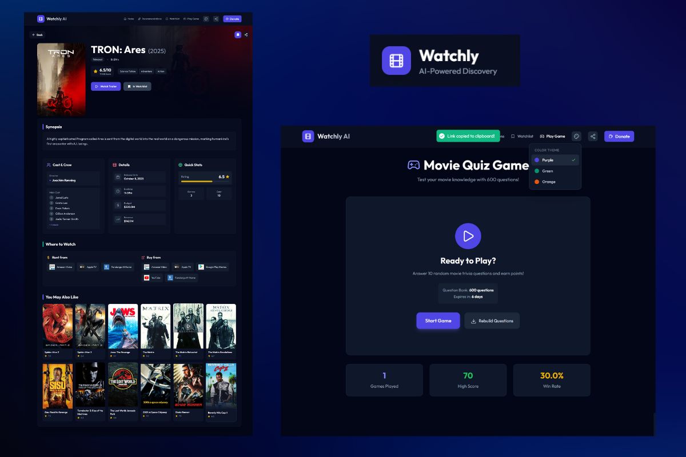

<div align="center">

# 🎬 Watchly AI

### Your Movie Discovery Companion

**Watchly: Discover, Track, Share.** 
Your all-in-one hub for movies & TV. Search millions of titles, save your watchlist, and share recommendations—all powered by TMDB's live database

[🚀 Live Demo](#) • [📖 Documentation](z-index/PROJECT_SUMMARY.md) • [🐛 Report Bug](#) • [✨ Request Feature](#)

</div>

---

## 📸 Screenshots

<div >

### 🖼️ App Gallery

## 📸 Screenshots Overview

- **Home + Recommendations:**
  
   

- **Details + Quiz Game:**
  
   


---

## 🔗 Direct Links to Full Screenshots

For quick access to the full-resolution images:
1. **[Home Page](Screenshots/homepage.png)** - Interactive Hero Carousel
2. **[Movie Details](Screenshots/moviedetails.png)** - Comprehensive Information
3. **[Watchlist](Screenshots/watchlist.png)** - Personal Collection
4. **[Smart Recommendations](Screenshots/recomendationspage.png)** - Advanced Filtering
5. **[Interactive Quiz](Screenshots/gamepage.png)** - AI-Generated Questions
6. **[Trending Movies](Screenshots/trendingmovies.png)** - Weekly Hot Picks

</div>

### 🏠 Home Page
> **Interactive hero carousel with 7 featured movies, particle effects, and smooth auto-advance**

- Dynamic movie posters with smooth transitions
- Particle effect animations in background
- Auto-advance every 5 seconds
- 4 content carousels (Trending, Top Rated Movies/TV, Upcoming)
- Feature cards for quick navigation

### 🎬 Movie Details
> **Comprehensive movie information with hero backdrop, cast, crew, and streaming options**

- Full-width backdrop image with gradient overlay
- Poster thumbnail with hover effects
- Rating, runtime, genres, and release info
- Cast & crew section with profile images
- Watch providers (streaming platforms)
- Similar movies grid with recommendations
- YouTube trailer integration

### 📚 Watchlist
> **Personal collection with sorting and filtering**

- Grid layout with movie posters
- Sort options: Recent, Title, Rating
- Remove button on hover
- Genre tags for each movie
- Rating badges and year display
- Empty state with suggestions

### 🎯 Smart Recommendations
> **Advanced filtering by genre, year, and rating**

- Content type toggle (Movies/TV)
- Multi-select genre chips (19+ genres)
- Year range slider (1950-2025)
- Minimum rating selector (6.0-9.5)
- Shuffle button for fresh picks
- 5-card curated display

### 🎮 Interactive Quiz
> **AI-generated trivia questions about your favorite movies**

- Progressive hint system
- Score tracking with visual progress
- Multiple choice questions (4 options)
- Replay functionality
- Themed UI with dynamic colors
- Difficulty progression

### 📊 Trending Movies
> **Weekly trending content with pagination**

- Grid layout with 20 movies per page
- Pagination controls
- Rating badges and year
- Smooth scroll to top
- Hover effects with scale animation

---

## ✨ Features

### 🎬 **Content Discovery**
- 📊 **Trending Movies** - What's hot this week
- ⭐ **Top Rated** - Critically acclaimed films & TV shows
- 🎥 **Upcoming Releases** - Coming soon to theaters
- 🔍 **AI-Powered Search** - Natural language queries with Gemini
- 🎡 **Interactive Carousels** - Smooth horizontal scrolling

### 🎨 **Customization**
- 🌈 **3 Theme Colors** - Purple (Indigo), Green (Emerald), Orange
- 🌙 **Dark Mode** - Easy on the eyes
- 💾 **Persistent Settings** - Your preferences saved locally
- 🎯 **Dropdown Selector** - Quick theme switching

### 📚 **Watchlist Management**
- ➕ **Quick Add/Remove** - One-click watchlist button
- 🔖 **Persistent Storage** - localStorage keeps your list safe
- 🔢 **Smart Sorting** - By recent, title, or rating
- 🏷️ **Genre Tags** - Visual categorization
- 📊 **Stats Display** - Rating badges and year

### 🎯 **Smart Recommendations**
- 🎭 **Genre Filtering** - 19+ genres for movies, 16+ for TV
- 📅 **Year Range** - From 1950 to 2025
- ⭐ **Rating Threshold** - Minimum 6.0 to 9.5
- 🎲 **Shuffle Algorithm** - Get fresh picks
- 🔄 **5-Card Display** - Curated selection

### 🎮 **Interactive Quiz**
- 🤖 **AI-Generated Questions** - Unique every time
- 💡 **Progressive Hints** - Get help when stuck
- 🏆 **Score Tracking** - Challenge yourself
- 🔄 **Replay** - Try again with new questions

### 🗺️ **Navigation & SEO**
- 🔗 **SEO-Friendly URLs** - `/movie/inception-27205`
- 📄 **Custom 404 Page** - Helpful error handling
- 🏠 **Resource Pages** - About, API Docs, Privacy, Terms
- ⬆️ **Scroll to Top** - Smooth navigation
- 📋 **Feature Cards** - Quick access tiles

### 💚 **User Experience**
- 🎉 **Toast Notifications** - Non-intrusive feedback
- 📋 **Clipboard Copy** - Share with one click
- ⚡ **Fast Loading** - Optimized performance
- 📱 **Fully Responsive** - Works on all devices
- ♿ **Accessible** - ARIA labels and keyboard navigation

---

## 🚀 Quick Start

### Prerequisites

- **Node.js** 18+ or **Bun** 1.0+
- **TMDB API Key** ([Get one here](https://www.themoviedb.org/settings/api))
- **Google Gemini API Key** ([Get one here](https://ai.google.dev/))

### Installation

1. **Clone the repository**
   ```bash
   git clone https://github.com/yourusername/watchly-ai.git
   cd watchly-ai
   ```

2. **Install dependencies**
   ```bash
   # Using npm
   npm install
   
   # Using bun
   bun install
   ```

3. **Set up environment variables**
   
   Create a `.env.local` file in the root directory:
   ```env
   VITE_TMDB_API_KEY=your_tmdb_api_key_here
   VITE_GEMINI_API_KEY=your_gemini_api_key_here
   ```

4. **Start the development server**
   ```bash
   # Using npm
   npm run dev
   
   # Using bun
   bun run dev
   ```

5. **Open in browser**
   ```
   http://localhost:5173
   ```

---

## 🏗️ Tech Stack

### Frontend
- **React 19.2.1** - UI library with latest features
- **TypeScript** - Type-safe development
- **Vite** - Lightning-fast build tool
- **Tailwind CSS** - Utility-first styling
- **React Router** - Client-side routing

### UI Components
- **Lucide React** - Beautiful icons
- **Embla Carousel** - Smooth carousels
- **React Hot Toast** - Toast notifications
- **Tailwind Merge** - Class name utilities

### APIs & Services
- **TMDB API** - Movie & TV data
- **Google Gemini AI** - Natural language search
- **Ko-fi** - Donation platform

---

## 📂 Project Structure

```
watchly-ai/
├── components/
│   ├── common/              # Reusable UI components
│   │   ├── LoadingGrid.tsx
│   │   ├── ErrorMessage.tsx
│   │   └── EmptyState.tsx
│   ├── layout/              # Layout components
│   │   ├── Header.tsx       # Navigation with theme dropdown
│   │   ├── Footer.tsx       # 4-column footer
│   │   └── SearchSection.tsx
│   ├── movieDetails/        # Movie detail components
│   │   ├── HeroSection.tsx  # Backdrop hero
│   │   ├── CastCrewCard.tsx
│   │   ├── SimilarMoviesGrid.tsx
│   │   └── TrailerModal.tsx
│   ├── recommendations/     # Recommendation system
│   │   ├── FilterPanel.tsx  # Advanced filters
│   │   └── RecommendationGrid.tsx
│   ├── ui/                  # Base UI primitives
│   │   └── pagination.tsx
│   ├── MovieCard.tsx        # Movie poster card
│   ├── FeatureCards.tsx     # Homepage navigation cards
│   └── Icons.tsx            # Custom icons
├── pages/                   # Route pages
│   ├── HomePage.tsx         # Landing with hero & carousels
│   ├── TrendingPage.tsx
│   ├── TopRatedMoviesPage.tsx
│   ├── TopRatedTVPage.tsx
│   ├── UpcomingMoviesPage.tsx
│   ├── RecommendationsPage.tsx
│   ├── MovieDetailsPage.tsx # Movie/TV details
│   ├── WatchlistPage.tsx    # Personal watchlist
│   ├── PlayGamePage.tsx     # Interactive quiz
│   ├── AboutPage.tsx
│   ├── ApiDocPage.tsx
│   ├── PrivacyPage.tsx
│   ├── TermsPage.tsx
│   └── NotFoundPage.tsx     # 404 error page
├── contexts/                # React Context
│   ├── ThemeContext.tsx     # Theme state & persistence
│   └── WatchlistContext.tsx # Watchlist state
├── services/                # API services
│   ├── tmdbService.ts       # TMDB API integration
│   └── geminiService.ts     # Gemini AI integration
├── lib/                     # Utilities
│   └── utils.ts             # Slug helpers, cn()
├── types/                   # TypeScript types
│   └── theme.ts             # Theme types & configs
├── App.tsx                  # Root component
└── index.tsx                # Entry point
```

---

## 🎨 Theme System

Watchly features a comprehensive theme system with 3 color schemes:

### Available Themes

| Theme | Primary Color | Use Case |
|-------|---------------|----------|
| 🟣 **Purple** | Indigo 600 | Default, vibrant |
| 🟢 **Green** | Emerald 600 | Nature, calm |
| 🟠 **Orange** | Orange 600 | Warm, energetic |

### How It Works

```typescript
// Theme is stored in localStorage as 'watchly-theme'
{
  "colorTheme": "purple" | "green" | "orange"
}

// Access theme in components
const { themeClasses } = useTheme();

// Use dynamic classes
<button className={themeClasses.button}>
  Click me
</button>
```

### Theme Properties

Each theme provides:
- `button` - Button background & hover
- `text` - Accent text color
- `border` - Border color
- `glow` - Shadow effect
- `bg` - Background tint

---

## 🔗 SEO-Friendly URLs

Movie URLs are optimized for search engines:

```
❌ Before: /movie/550
✅ After:  /movie/fight-club-550

❌ Before: /movie/27205
✅ After:  /movie/inception-27205
```

### Implementation

```typescript
// lib/utils.ts
export const createMovieSlug = (title: string, id: number) => {
  return `${slugify(title)}-${id}`;
};

export const extractIdFromSlug = (slug: string) => {
  const parts = slug.split('-');
  return parseInt(parts[parts.length - 1]);
};
```

Benefits:
- 🔍 Better SEO ranking
- 📋 Readable URLs
- 🔗 Shareable links
- 🎯 Still uses reliable ID for data fetching

---

## 📊 API Integration

### TMDB API

**Base URL:** `https://api.themoviedb.org/3`

**Key Endpoints:**
- `/trending/movie/week` - Trending movies
- `/movie/top_rated` - Top rated movies
- `/tv/top_rated` - Top rated TV shows
- `/movie/upcoming` - Upcoming releases
- `/discover/movie` - Advanced filtering
- `/movie/{id}` - Movie details
- `/movie/{id}/credits` - Cast & crew
- `/movie/{id}/videos` - Trailers
- `/movie/{id}/similar` - Similar content
- `/movie/{id}/watch/providers` - Streaming options

**Caching:** 5-minute in-memory cache for API responses

### Google Gemini AI

**Model:** `gemini-2.0-flash-exp`

**Features:**
- Natural language movie search
- AI-generated quiz questions
- Contextual recommendations

---

## 🤝 Contributing

We welcome contributions! Here's how:

1. **Fork the repository**
2. **Create a feature branch**
   ```bash
   git checkout -b feature/amazing-feature
   ```
3. **Commit your changes**
   ```bash
   git commit -m 'Add amazing feature'
   ```
4. **Push to the branch**
   ```bash
   git push origin feature/amazing-feature
   ```
5. **Open a Pull Request**

### Development Guidelines

- ✅ Use TypeScript for all new files
- ✅ Follow existing code style
- ✅ Add comments for complex logic
- ✅ Test on multiple devices
- ✅ Update documentation

---

## 📝 Changelog

### v2.0.0 (December 9, 2025)

**🎨 Theme System**
- 3 color themes with dropdown selector
- Dark mode optimization
- All components dynamically themed

**🗺️ Navigation**
- SEO-friendly URL slugs
- Custom 404 page
- Resource pages (About, API, Privacy, Terms)

**🎬 UI Improvements**
- Interactive hero carousel
- Feature cards
- Themed buttons & icons
- Share with clipboard copy

**🐛 Bug Fixes**
- Watchlist genre handling
- Type mismatches
- Invalid slug errors

### v1.0.0 (December 8, 2025)

**Initial Release**
- Core browsing functionality
- AI-powered search
- Watchlist management
- Interactive quiz game
- Responsive design

---

## 📄 License

This project is licensed under the **MIT License** - see the [LICENSE](LICENSE) file for details.

---

## 🙏 Acknowledgments

### APIs & Services
- [TMDB](https://www.themoviedb.org/) - Movie database & images
- [Google Gemini](https://ai.google.dev/) - AI-powered search
- [Ko-fi](https://ko-fi.com/) - Donation platform

### Libraries & Tools
- [React](https://react.dev/) - UI library
- [Vite](https://vitejs.dev/) - Build tool
- [Tailwind CSS](https://tailwindcss.com/) - Styling
- [Lucide](https://lucide.dev/) - Icons
- [React Hot Toast](https://react-hot-toast.com/) - Notifications
- [Embla Carousel](https://www.embla-carousel.com/) - Carousels

### Inspiration
- **Netflix** - UI/UX patterns
- **Letterboxd** - Social features
- **IMDb** - Comprehensive data
- **Trakt** - List management

---

## 💖 Support

If you find Watchly useful, consider:

- ⭐ **Star this repo** on GitHub
- ☕ **Buy me a coffee** on [Ko-fi](https://ko-fi.com/mahmoudapp)
- 🐦 **Share** with friends
- 🐛 **Report bugs** to help improve
- ✨ **Request features** you'd like to see

---

## 📧 Contact

**Mahmoud App**

- Portfolio: [https://mahmoud-portfolio-two.vercel.app/](#)
- GitHub: [@mahmoud-ath](#)
- Email: contact@watchly.app

---

<div align="center">

**Built with ❤️ using React, TypeScript, Tailwind CSS, TMDB API, and Google Gemini AI**

⭐ Star this repo if you like it! ⭐

[🔝 Back to Top](#-watchly-ai)

</div>
